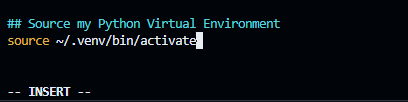
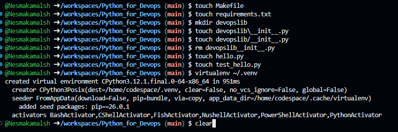
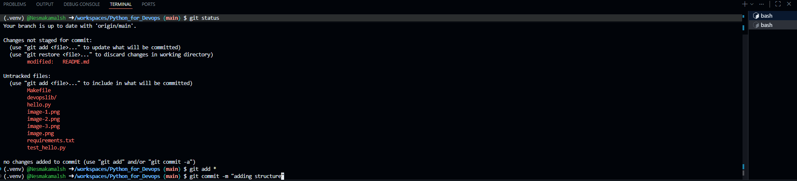

# Python_for_Devops

## Create a project scaffold

* Create development environment that is cloud-based:
### Colab notebook 
### Github code spaces

Build out python project scaffold:

#### Makefile:
  * It automates build steps (like compiling and linking code) by listing targets (what to build), prerequisites (what’s needed), and recipes (commands to run)
  * It tracks dependencies so make only recompiles files that have changed, saving time and avoiding unnecessary work
  * It can also run other tasks (e.g., cleaning up files, generating data) when requested
#### requirements.txt
#### test_library.py
#### python_library
#### Dockerfile
#### command_line_tool
#### Microservice

1. Create a virtualenv `virtualenv ~/.venv`

* `virtualenv` Command: virtualenv is a Python tool that creates an isolated Python environment.
This environment has its own Python interpreter, pip, and site-packages directory.
It prevents conflicts between different projects’ dependencies.
* `~/.venv` Path:
`~` means your home directory (e.g., /home/username on Linux/Mac).
`.venv` is a hidden folder (dot prefix makes it hidden in ls unless you use ls -a).
So `~/.venv` is a hidden virtual environment stored in your home directory.
* What It Actually Does
Creates a directory structure like:

>~/.venv/  
>├── bin/        # executables (python, pip, activate scripts)  
>├── lib/        # installed Python packages  
>└── pyvenv.cfg  # environment configuration  
>Installs a fresh copy of Python and pip inside it.  

2. edit my ~/.bashrc  `vim ~/.bashrc`
* `vim` is a text editor in the terminal. It opens files for editing directly in the shell.
* `~/.bashrc` `~` : your home directory (e.g., /home/username on Linux/Mac).  
* `.bashrc` is a hidden configuration file for the Bash shell.  
It runs every time you start a new interactive shell session (like opening a new terminal tab or SSH session).  
It’s used to set:  
>Environment variables (PATH, EDITOR, etc.)  
>Aliases (alias ll='ls -la')  
>Shell options  
>Functions  
>Prompt customization  
* The Command Opens the `.bashrc` file in Vim so you can view or edit it.
>In Vim  
:w → Write (save) the file.  
:q → Quit Vim.  
:wq → Save and quit in one step.  
:q! → Quit without saving changes.  

> 1. Open the File
`vim ~/.bashrc`
> 2. Enter Insert Mode  
Vim starts in Normal mode (where keys are commands, not text).
To start typing, press one of these keys:  

>i	Insert before the cursor (most common)  
I	 Insert at the start of the current line  
a	 Append after the cursor  
A	 Append at the end of the current line  
o	 Open a new line below and start typing  
O	 Open a new line above and start typing  

Example:
>If you want to add something at the bottom of the file:  
Press G (go to end of file).  
Press o (new line below).  
Start typing.  
  
Type Your Text. Once in Insert mode, you can type normally.

>3. Exit Insert Mode  
Press Esc to go back to Normal mode.
>4. Save and Quit `:wq`
and press Enter.

### AWS cloudShell
### AWS cloud9

## Command-Line Tools

## Microservices

## Containerized Continous Delivery

# Bash shell
Bash is a shell scripting language , a command‑line interface interpreter that runs commands and can execute scripts.

* touch: touch command is a Linux/Unix shell utility used to create new empty files or update the access and modification timestamps of existing files --> ex in terminal: touch Makefile
* rm: deletes a file --> ex in terminal: rm devopslib__init__.py
* clear: Removes all visible text from the terminal Ctrl + L (works in most shells, same as clear).

* `git add` Stages changes (new files, modifications, deletions) so they are ready to be committed. `git add *` * is not a Git feature — it’s a shell glob (wildcard) that matches all files and directories in the current directory (but not hidden files starting with .).
The shell expands * before Git sees it.
* `git commit -m ""` -m means a commit message  
